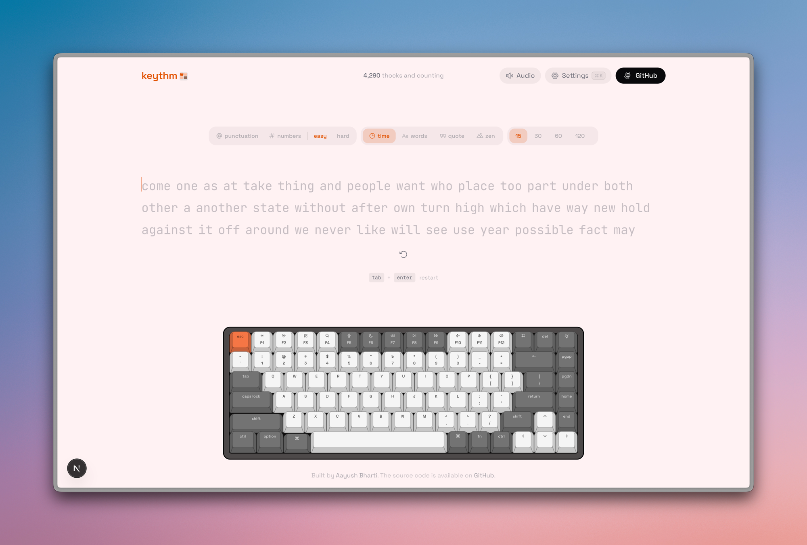

<a name="readme-top"></a>



<p align="center">
  <h3 align="center">Keythm</h3>
  <p align="center">
    A free typing test with realistic mechanical keyboard sounds
    <br />
    <a href="https://github.com/talha-096/Keythm"><strong>Try it live »</strong></a>
    <br />
    <br />
    <a href="https://github.com/talha-096/Keythm">Website</a>
    &middot;
    <a href="https://github.com/talha-096/Keythm/issues">Issues</a>
    &middot;
    <a href="https://github.com/talha-096/Keythm/issues/new?labels=enhancement&template=FEATURE_REQUEST_TEMPLATE.md">Request Feature</a>
  </p>
</p>

<p align="center">
  <a href="https://github.com/talha-096">
    
  </a>
  <a href="https://github.com/talha-096/Keythm/stargazers">
    
  </a>
  <a href="https://github.com/talha-096/Keythm/forks">
    
  </a>
  <a href="https://github.com/talha-096/Keythm/blob/main/LICENSE">
    
  </a>
  <a href="https://www.typescriptlang.org/">
    
  </a>
  <a href="https://github.com/talha-096/Keythm/commits/main">
    
  </a>
  <a href="https://github.com/talha-096/Keythm/pulls">
    
  </a>
  
</p>

<details>
<summary>Table of Contents</summary>

- [About](#about)
- [Features](#-features)
- [Tech Stack](#-tech-stack)
- [Getting Started](#-getting-started)
- [Scripts](#-scripts)
- [Contributing](#-contributing)
- [Follow Me](#-follow-me)
- [Deployment](#-deployment)
- [Give A Star](#-give-a-star)
- [Star History](#-star-history)


</details>

## About

**Keythm** is a free online typing test with **realistic mechanical keyboard sounds** and real-time WPM tracking. Practice with timed tests, word counts, quotes, or zen mode — featuring an interactive on-screen keyboard, satisfying key sounds, and detailed accuracy stats.

## ✨ Features

| Area | What you get |
|------|----------------|
| **Test modes** | Time (15s–120s), word count, quotes (length presets), zen |
| **Mechanical key sounds** | Realistic per-key audio feedback via Web Audio; multiple keyboard themes |
| **Virtual keyboard** | Interactive on-screen keyboard that highlights keys as you type (desktop) |
| **Results** | WPM, raw speed, accuracy, character breakdown, consistency, elapsed time, WPM-over-time chart |
| **Keyboard themes** | 6 color schemes — Classic, Mint, Royal, Dolch, Sand, Scarlet — each tints the entire UI |
| **Typing fonts** | 9 fonts — Geist Mono, JetBrains Mono, Fira Code, IBM Plex Mono, Source Code Pro, Inter Tight, Space Grotesk, Nunito, Atkinson Hyperlegible |
| **Settings** | Theme (light/dark/system), accent color, font picker, show keyboard, sound volume, live WPM, ghost mode |
| **Haptics** | Optional vibration on supported hardware |

Settings persist in `localStorage`.

## 🛠 Tech Stack

<details><summary><b>Keythm</b> is built using the following technologies:</summary>

- [TypeScript](https://www.typescriptlang.org/): Typed superset of JavaScript.
- [Next.js](https://nextjs.org/) 16: React framework with App Router.
- [React](https://react.dev/) 19: UI library.
- [Tailwind CSS](https://tailwindcss.com/): Utility-first CSS framework.
- [Base UI](https://base-ui.com/): Unstyled, accessible component primitives from MUI.
- [shadcn/ui](https://ui.shadcn.com/): Pre-styled component recipes.
- [Motion](https://motion.dev/): Animation library for React.
- [Recharts](https://recharts.org/): Composable charting library.
- [Drizzle ORM](https://orm.drizzle.team/) + LibSQL: Type-safe database layer.
- [Biome](https://biomejs.dev/): Fast linter and formatter.
- [Serwist](https://serwist.pages.dev/): PWA / service worker toolkit.
- [Vercel](https://vercel.com/): Deployment platform.

</details><br/>

[](https://github.com/talha-096)

## 🧰 Getting Started

1. Make sure [Git](https://git-scm.com/downloads) and [Bun](https://bun.sh/) (or Node.js 20+) are installed.
2. Fork this repository and clone **your fork**:

   ```bash
   git clone https://github.com/talha-096/Keythm.git
   cd Keythm
   ```

3. Install dependencies and start the dev server:

   ```bash
   bun install
   bun dev
   ```

4. Open [http://localhost:3000](http://localhost:3000) in your browser.

## 📜 Scripts

| Command | Description |
|--------|-------------|
| `bun dev` | Development server |
| `bun run build` | Optimized production build |
| `bun start` | Serve the production build |
| `bun run lint` | Lint with Biome |
| `bun run lint:fix` | Lint and auto-fix with Biome |
| `bun run format` | Format with Biome |
| `bun run typecheck` | Type-check with TypeScript |

## 🔧 Contributing

[](https://github.com/talha-096/Keythm/graphs/contributors)

Contributions are what make the open source community such an amazing place to learn, inspire, and create. Any contributions you make are **greatly appreciated**.

1. Fork the repo
2. Create a new branch (`git checkout -b improve-feature`)
3. Make the appropriate changes in the files
4. Commit your changes (`git commit -am 'Improve feature'`)
5. Push to the branch (`git push origin improve-feature`)
6. Create a Pull Request

## 🚀 Follow Me

[](https://github.com/talha-096 "Follow Me")

## 📃 Deployment

| Method                     | Description                              | Action                                                                                                                                                         |
| :------------------------- | :--------------------------------------- | :------------------------------------------------------------------------------------------------------------------------------------------------------------- |
| **🔧 Manual Build**        | Create an optimized production build.    | `bun run build`                                                                                                                                                |
| **▲ Vercel (Recommended)** | Deploy instantly on the Vercel platform. | [](https://vercel.com/new/clone?repository-url=https%3A%2F%2Fgithub.com%2Ftalha-096%2FKeythm)               |
| **🌐 Netlify**             | Deploy easily on Netlify.                | [](https://app.netlify.com/start/deploy?repository=https://github.com/talha-096/Keythm) |

For more details, check the [Next.js deployment docs](https://nextjs.org/docs/deployment).

## ⭐ Give A Star

If you found this project useful, give it a star to help more people discover it!

## 🌟 Star History

<a href="https://star-history.com/#talha-096/Keythm&Timeline">
<picture>
  <source media="(prefers-color-scheme: dark)" srcset="https://api.star-history.com/svg?repos=talha-096/Keythm&type=Timeline&theme=dark" />
  <source media="(prefers-color-scheme: light)" srcset="https://api.star-history.com/svg?repos=talha-096/Keythm&type=Timeline" />
  
</picture>
</a>

<br />
<p align="right">(<a href="#readme-top">back to top</a>)</p>
